<!-- ChunkSmith Hybrid Server Functional Specification -->

# サーバー機能仕様書（詳細版）

作成日: 2026-01-29  
対象: `server/` 配下の FastAPI サーバー実装  
目的: 実装準拠の機能仕様を詳細に整理する

---

## 目次
1. [目的と範囲](#1-目的と範囲)
2. [用語集](#2-用語集)
3. [全体構成](#3-全体構成)
4. [データモデル仕様](#4-データモデル仕様)
5. [ストレージ仕様（JSON 永続化）](#5-ストレージ仕様json-永続化)
6. [API 仕様（詳細）](#6-api-仕様詳細)
7. [処理フロー（シーケンス図）](#7-処理フローシーケンス図)
8. [チャンク生成仕様](#8-チャンク生成仕様)
9. [OpenSearch 連携仕様](#9-opensearch-連携仕様)
10. [Embedding 連携仕様](#10-embedding-連携仕様)
11. [JSONL 取り込み仕様](#11-jsonl-取り込み仕様)
12. [エラーコードと HTTP ステータス](#12-エラーコードと-http-ステータス)
13. [設定・環境変数](#13-設定環境変数)
14. [非機能要件・制約](#14-非機能要件制約)
15. [既知の制約・改善余地](#15-既知の制約改善余地)

---

## 1. 目的と範囲
### 1.1 目的
- PDF/JSONL を受け取り、抽出・編集・チャンク分割を実施する。
- 生成したチャンクを OpenSearch に登録し、検索 API を提供する。
- セッション/バッチ/ジョブの状態を JSON で永続化し、簡易運用を可能にする。

### 1.2 対象範囲
- 対象: API、バックグラウンド job、OpenSearch 連携、Embedding 連携、ストレージ
- 対象外: 認証/認可、監視・アラート、運用自動化、UI

---

## 2. 用語集
| 用語 | 説明 |
|---|---|
| セッション (Session) | 1 ドキュメントの編集状態・チャンク状態を保持する単位 |
| チャンク (Chunk) | 分割されたテキスト断片。OpenSearch へ登録される最小単位 |
| ページマーカー | `<<<PAGE:N>>>` 形式の境界マーカー（全文テキスト内） |
| PageSpan | ページ境界（青線）。全文テキスト内の開始/終了位置 |
| ChildChunk | チャンク境界（赤線）。PageSpan 内の区間 |
| バッチ (Batch) | 複数ファイルをまとめて処理する単位 |
| ジョブ (Job) | commit の進捗を管理するバックグラウンド処理 |
| commit | セッションのチャンクを OpenSearch に登録する処理 |
| embedding | テキストをベクトル化する処理 |

---

## 3. 全体構成
### 3.1 コンポーネント
- **API サーバー**: FastAPI でエンドポイントを提供
- **ストレージ**: JSON ファイルで永続化（sessions/batches/jobs）
- **PDF 抽出**: PyMuPDF によりページ単位の抽出
- **Embedding**: OpenAI 互換 API を LangChain で利用
- **OpenSearch**: kNN ベクトル検索と全文検索

### 3.2 ディレクトリ構成
- `server/app/api/` … API ルーティング
- `server/app/core/` … 設定・モデル・ストレージ・エラー・チャンク処理
- `server/app/integrations/` … PDF/JSONL/OpenSearch/Embedding 連携
- `server/app/jobs/` … commit ジョブ定義と実行

### 3.3 起動時処理
- `CHUNKSMITH_CLEAR_STORAGE_ON_STARTUP=true` の場合、`sessions/jobs/batches` をパージ（`.gitkeep` 除外）。
- Embedding モデルを探索し、利用可能なモデルを runtime state に登録。

---

## 4. データモデル仕様
### 4.1 セッション関連
**Session**
- `session_id` / `doc_id` / `batch_id?`
- `source_type`: `pdf | jsonl`
- `extract_meta`: 抽出メタ（抽出ツール名/バージョン/ページ数/警告）
- `base_pages`: 抽出元ページ（不変）
- `current_pages`: 編集後ページ（正規化反映）
- `current_text`: ページマーカーを含む全文
- `page_map`: PageSpan 配列
- `chunks`: ChildChunk 配列
- `chunk_metadata`: `chunk_id -> ChunkMetadata`
- `version`: 楽観ロック用
- `created_at` / `updated_at`

**ChunkStrategy**
- `chunk_size`（100〜10000）
- `overlap`（0〜1000）
- `split_mode`（`chars | paragraph | heading`）
- `normalize`（正規化 ON/OFF）

**ChunkMetadata**
- `content_type`（`body | table | bullets | caption | other`）
- `heading_path`
- `note`
- `quality_flag`（`good | suspect | broken`）
- `custom`（JSONL 由来の任意メタ）

### 4.2 バッチ関連
**Batch**
- `batch_id`, `name`
- `files: BatchFileInfo[]`
- `created_at` / `updated_at`

**BatchFileInfo**
- `filename`
- `session_id?`
- `status`: `pending | ready | committing | committed | error`
- `error?`
- `chunk_count?`, `page_count?`
- `job_id?`

### 4.3 ジョブ関連
**Job（JSON 永続）**
- `job_id`, `session_id`, `job_type`
- `embedding_model`, `index_name?`
- `status`: `queued | running | succeeded | failed`
- `progress`（0.0〜1.0）
- `total`, `succeeded`, `failed`
- `error_samples`（最大 5 件）
- `created_at`, `started_at`, `completed_at`

---

## 5. ストレージ仕様（JSON 永続化）
### 5.1 保存先
- `CHUNKSMITH_STORAGE_DIR/sessions/{session_id}.json`
- `CHUNKSMITH_STORAGE_DIR/batches/{batch_id}.json`
- `CHUNKSMITH_STORAGE_DIR/jobs/{job_id}.json`

### 5.2 書き込み方式
- 一時ファイルへ書き出し後、`os.replace` で置換（原子的更新）。
- JSON は UTF-8 / pretty print。
- `datetime` は ISO 形式で保存。

### 5.3 パージ
- 起動時に設定で有効化されている場合のみパージ。
- `.gitkeep` は削除対象外。

---

## 6. API 仕様（詳細）
### 6.1 共通事項
- Base Path: `/api`（一部 `/healthz`, `/`）
- 認証: なし
- CORS: `CHUNKSMITH_CORS_ORIGINS`
- エラー形式:
  ```json
  {
    "error": {
      "code": "ERROR_CODE",
      "message": "human readable",
      "detail": {}
    }
  }
  ```

### 6.2 Sessions
#### POST `/api/sessions`
**入力**: `multipart/form-data`
- `file` (PDF)
- `doc_id?`

**処理**:
1) PDF サイズ検証（`CHUNKSMITH_MAX_PDF_MB`）  
2) PDF 抽出 → `base_pages`  
3) `ChunkStrategy` 初期化  
4) 正規化（`normalize` の場合）  
5) ページマーカー生成 → `current_text`  
6) `page_map` / `chunks` 生成  
7) Session 保存  

**出力**: `SessionResponse`

#### GET `/api/sessions/{session_id}`
**出力**: `SessionResponse`

#### PUT `/api/sessions/{session_id}/text`
**入力**: `UpdateTextRequest { version, current_text }`  
**処理**:
- `version` 不一致 → 409  
- ページマーカー検証・再構築  
- 再チャンク  
- `version` を +1  

**出力**: `UpdateTextResponse { version, current_text, page_map, chunks }`

#### PUT `/api/sessions/{session_id}/chunk_strategy`
**入力**: `UpdateChunkStrategyRequest { version, chunk_strategy }`  
**処理**:
- `version` 不一致 → 409  
- `base_pages` から全文再構築  
- 再チャンク  
- `version` を +1  

**出力**: `UpdateChunkStrategyResponse { chunk_strategy, page_map, chunks }`

#### POST `/api/sessions/{session_id}/commit`
**入力**: `CommitRequest { embedding_model, index_name? }`  
**処理**: Job 作成 → バックグラウンド実行  
**出力**: `CommitResponse { job_id }`

#### POST `/api/sessions/jsonl/preview`
**入力**: `multipart/form-data`（`file`, `doc_id?`）  
**出力**: `{ total_chunks, preview[], warnings[], doc_ids[] }`  
**備考**: 解析失敗時は `{ error, ... }` を返す。

#### POST `/api/sessions/jsonl`
**入力**: `multipart/form-data`（`file`, `doc_id?`）  
**出力**: `SessionResponse`  
**備考**:
- JSONL の各行が 1 chunk。  
- `metadata` は `chunk_metadata[chunk_id].custom` に格納。  
- `split_mode=chars`, `normalize=false` 固定。

### 6.3 Chunks
#### GET `/api/sessions/{session_id}/chunks/{chunk_id}`
**出力**: `ChunkDetailResponse`（テキスト、位置、メタデータ等）

#### PUT `/api/sessions/{session_id}/chunks/{chunk_id}/metadata`
**入力**: `UpdateChunkMetadataRequest`  
**出力**: `{ ok: true }`

### 6.4 Batches
#### POST `/api/batches`
**入力**: `multipart/form-data`（`files[]`, `batch_name?`）  
**処理**: 各ファイルを JSONL/PDF 判定 → セッション化  
**出力**: `BatchResponse`

#### GET `/api/batches`
**出力**: `BatchListResponse`（作成日時降順）

#### GET `/api/batches/{batch_id}`
**出力**: `BatchResponse`（必要に応じ `chunk_count/page_count` 再計算）

#### DELETE `/api/batches/{batch_id}`
**出力**: `{ deleted: true, batch_id }`  
**備考**: セッション自体は削除しない。

#### POST `/api/batches/{batch_id}/files`
**入力**: `multipart/form-data`（`files[]`）  
**出力**: `BatchResponse`

#### POST `/api/batches/{batch_id}/commit`
**入力**: `BatchCommitRequest { embedding_model, index_name? }`  
**処理**: ready の各ファイルに Job 作成  
**出力**: `BatchCommitResponse { job_ids, job_session_map, skipped_files, total_jobs }`

#### PUT `/api/batches/{batch_id}/files/{session_id}/status`
**入力**: `status`, `job_id?`  
**出力**: `{ updated: true }`

### 6.5 Search
#### POST `/api/search`
**入力**: `SearchRequest { query, mode, top_k, filters?, embedding_model?, vector?, index_name? }`  
**処理**:
- `index_name` 指定時はモデルキーを推定。  
- `vector` 未指定なら embedding を生成。  
**出力**: `SearchResponse { mode, index_name, top_k, took_ms, hits[] }`

**filters 仕様**:
- `filters` は `field -> value` の辞書。  
- すべて `term` フィルタとして適用（型変換なし）。

### 6.6 Embedding
#### GET `/api/embedding/models`
**出力**: `{ models: string[] }`

#### GET `/api/embedding/models/dimensions`
**出力**: `{ models: [{ model, dimension }] }`  
**備考**: dimension 取得に失敗したモデルは除外。

### 6.7 Indices
#### GET `/api/indices`
**出力**: `IndexListResponse`

#### GET `/api/indices/{index_name}`
**出力**: `IndexInfo`

#### DELETE `/api/indices/{index_name}`
**出力**: `IndexDeleteResponse`

### 6.8 Jobs
#### GET `/api/jobs/{job_id}`
**出力**: `JobStatusResponse`

### 6.9 Health / Root
#### GET `/healthz`
**出力**: `HealthResponse { status, env }`

#### GET `/`
**出力**: `{ name, version, docs, health }`

---

## 7. 処理フロー（シーケンス図）
### 7.1 PDF セッション作成
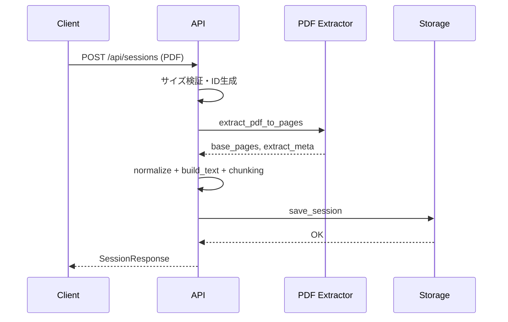
```mermaid
sequenceDiagram
  participant Client
  participant API
  participant PDF as PDF Extractor
  participant Storage
  Client->>API: POST /api/sessions (PDF)
  API->>API: サイズ検証・ID生成
  API->>PDF: extract_pdf_to_pages
  PDF-->>API: base_pages, extract_meta
  API->>API: normalize + build_text + chunking
  API->>Storage: save_session
  Storage-->>API: OK
  API-->>Client: SessionResponse
```

### 7.2 テキスト更新（再チャンク）
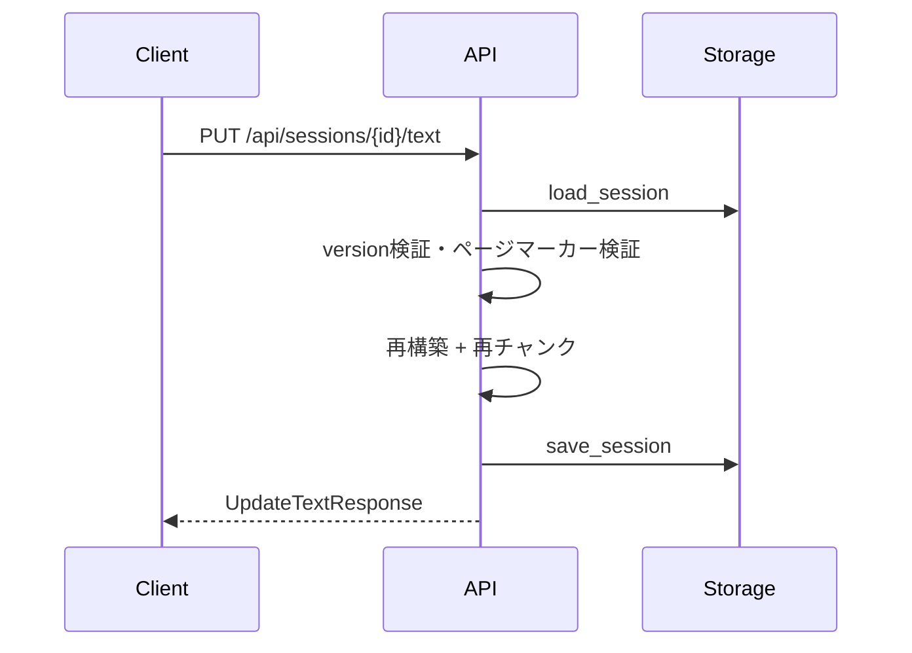
```mermaid
sequenceDiagram
  participant Client
  participant API
  participant Storage
  Client->>API: PUT /api/sessions/{id}/text
  API->>Storage: load_session
  API->>API: version検証・ページマーカー検証
  API->>API: 再構築 + 再チャンク
  API->>Storage: save_session
  API-->>Client: UpdateTextResponse
```

### 7.3 チャンク戦略更新
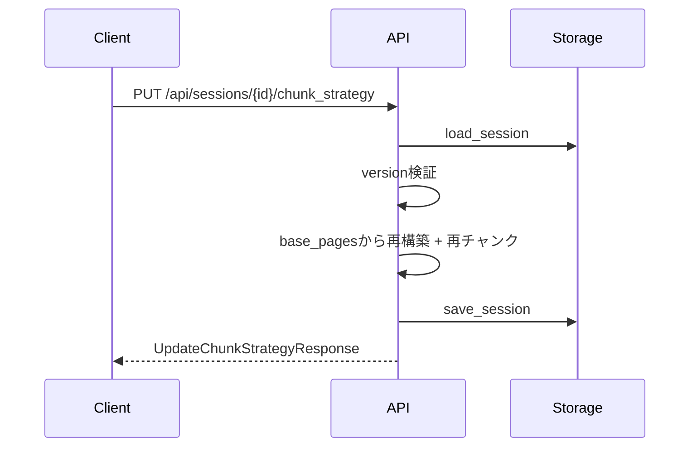
```mermaid
sequenceDiagram
  participant Client
  participant API
  participant Storage
  Client->>API: PUT /api/sessions/{id}/chunk_strategy
  API->>Storage: load_session
  API->>API: version検証
  API->>API: base_pagesから再構築 + 再チャンク
  API->>Storage: save_session
  API-->>Client: UpdateChunkStrategyResponse
```

### 7.4 commit（OpenSearch 登録）
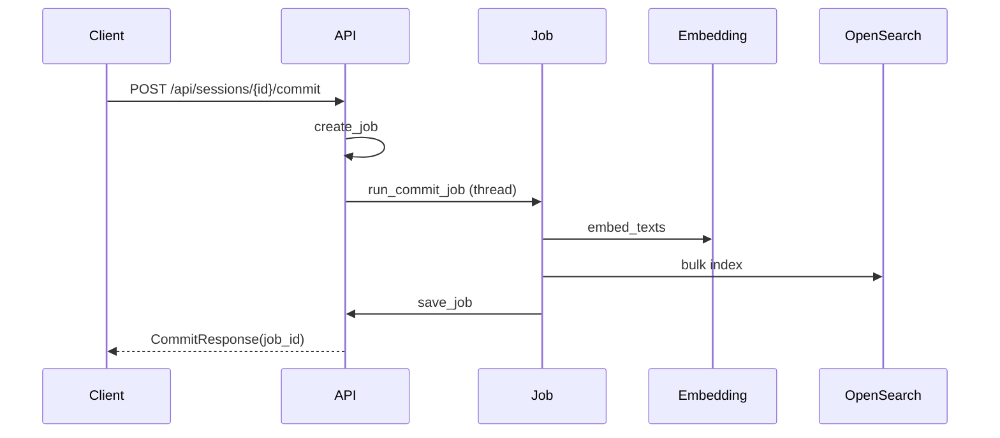
```mermaid
sequenceDiagram
  participant Client
  participant API
  participant Job
  participant Emb as Embedding
  participant OS as OpenSearch
  Client->>API: POST /api/sessions/{id}/commit
  API->>API: create_job
  API->>Job: run_commit_job (thread)
  Job->>Emb: embed_texts
  Job->>OS: bulk index
  Job->>API: save_job
  API-->>Client: CommitResponse(job_id)
```

### 7.5 JSONL プレビュー
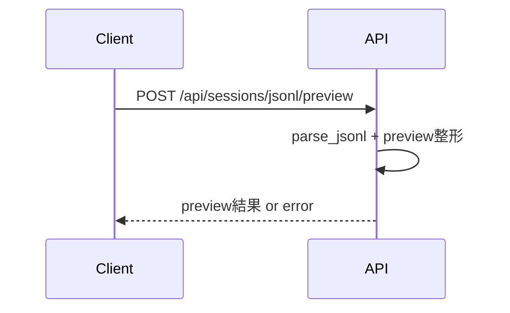
```mermaid
sequenceDiagram
  participant Client
  participant API
  Client->>API: POST /api/sessions/jsonl/preview
  API->>API: parse_jsonl + preview整形
  API-->>Client: preview結果 or error
```

### 7.6 JSONL インポート
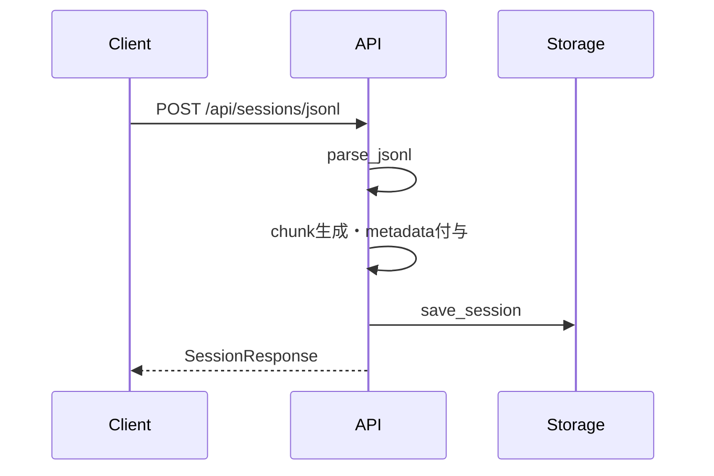
```mermaid
sequenceDiagram
  participant Client
  participant API
  participant Storage
  Client->>API: POST /api/sessions/jsonl
  API->>API: parse_jsonl
  API->>API: chunk生成・metadata付与
  API->>Storage: save_session
  API-->>Client: SessionResponse
```

### 7.7 セッション取得
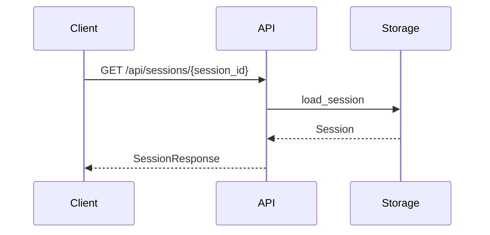
```mermaid
sequenceDiagram
  participant Client
  participant API
  participant Storage
  Client->>API: GET /api/sessions/{session_id}
  API->>Storage: load_session
  Storage-->>API: Session
  API-->>Client: SessionResponse
```

### 7.8 チャンク詳細取得
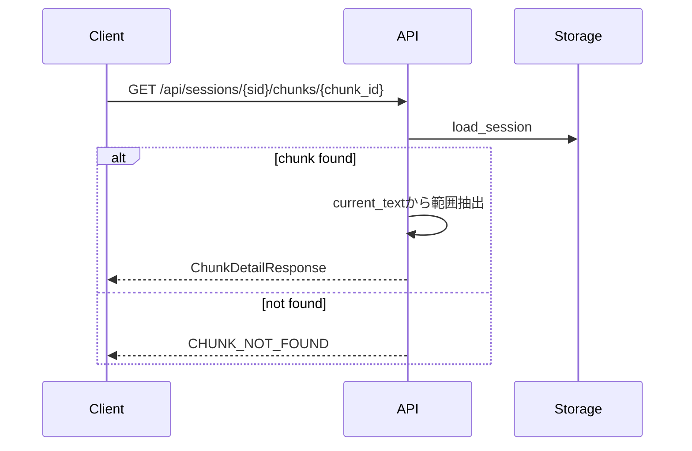
```mermaid
sequenceDiagram
  participant Client
  participant API
  participant Storage
  Client->>API: GET /api/sessions/{sid}/chunks/{chunk_id}
  API->>Storage: load_session
  alt chunk found
    API->>API: current_textから範囲抽出
    API-->>Client: ChunkDetailResponse
  else not found
    API-->>Client: CHUNK_NOT_FOUND
  end
```

### 7.9 チャンクメタデータ更新
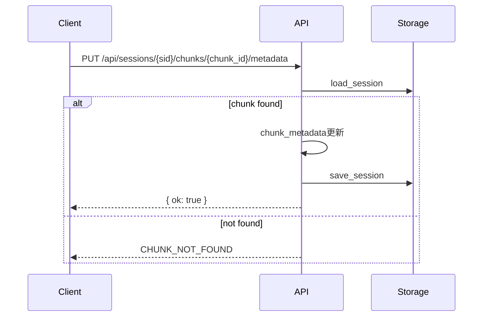
```mermaid
sequenceDiagram
  participant Client
  participant API
  participant Storage
  Client->>API: PUT /api/sessions/{sid}/chunks/{chunk_id}/metadata
  API->>Storage: load_session
  alt chunk found
    API->>API: chunk_metadata更新
    API->>Storage: save_session
    API-->>Client: { ok: true }
  else not found
    API-->>Client: CHUNK_NOT_FOUND
  end
```

### 7.10 バッチ作成（複数ファイル）
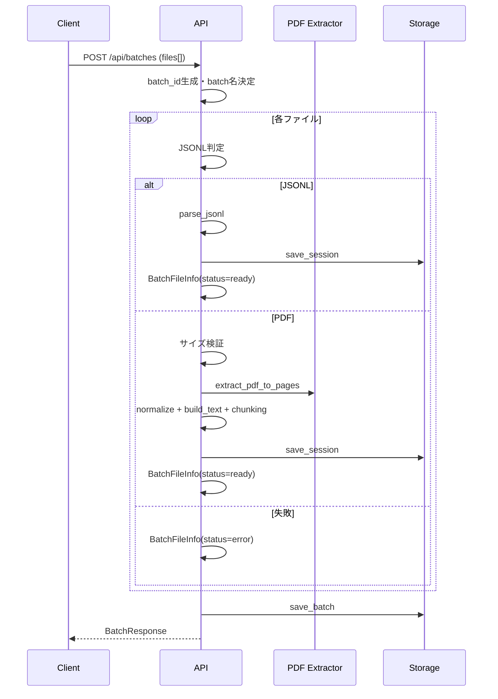
```mermaid
sequenceDiagram
  participant Client
  participant API
  participant PDF as PDF Extractor
  participant Storage
  Client->>API: POST /api/batches (files[])
  API->>API: batch_id生成・batch名決定
  loop 各ファイル
    API->>API: JSONL判定
    alt JSONL
      API->>API: parse_jsonl
      API->>Storage: save_session
      API->>API: BatchFileInfo(status=ready)
    else PDF
      API->>API: サイズ検証
      API->>PDF: extract_pdf_to_pages
      API->>API: normalize + build_text + chunking
      API->>Storage: save_session
      API->>API: BatchFileInfo(status=ready)
    else 失敗
      API->>API: BatchFileInfo(status=error)
    end
  end
  API->>Storage: save_batch
  API-->>Client: BatchResponse
```

### 7.11 バッチ一覧取得
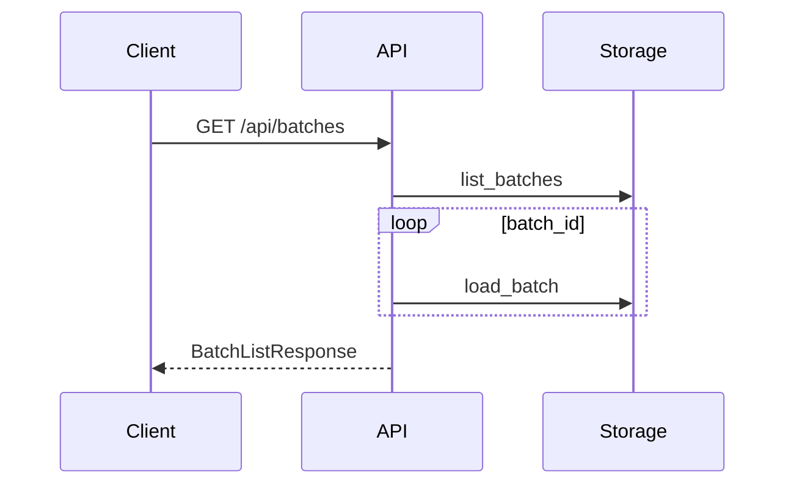
```mermaid
sequenceDiagram
  participant Client
  participant API
  participant Storage
  Client->>API: GET /api/batches
  API->>Storage: list_batches
  loop batch_id
    API->>Storage: load_batch
  end
  API-->>Client: BatchListResponse
```

### 7.12 バッチ詳細取得
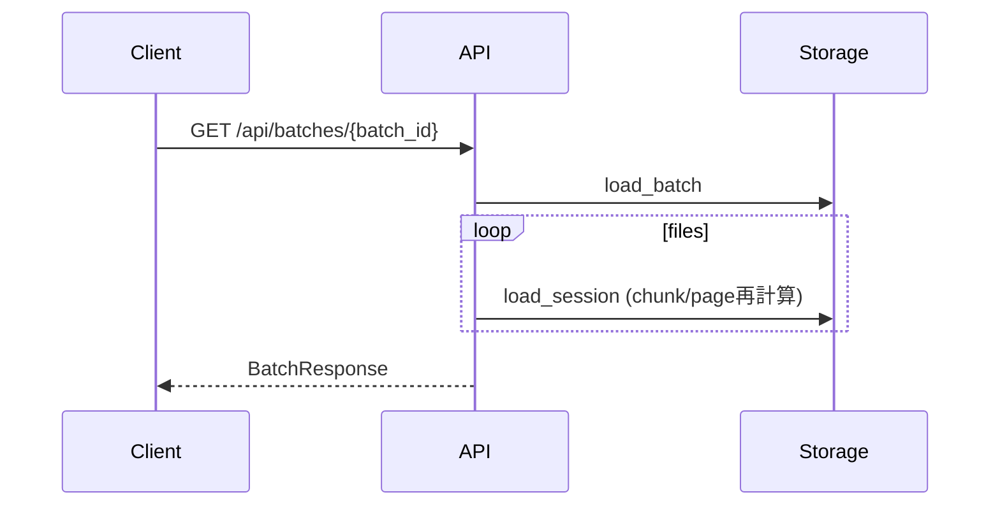
```mermaid
sequenceDiagram
  participant Client
  participant API
  participant Storage
  Client->>API: GET /api/batches/{batch_id}
  API->>Storage: load_batch
  loop files
    API->>Storage: load_session (chunk/page再計算)
  end
  API-->>Client: BatchResponse
```

### 7.13 バッチ削除
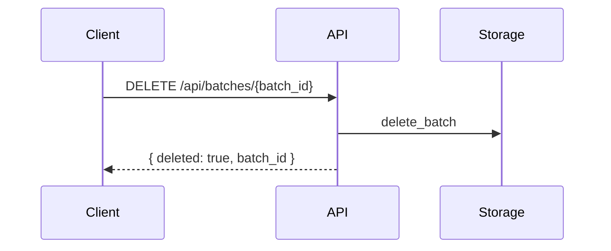
```mermaid
sequenceDiagram
  participant Client
  participant API
  participant Storage
  Client->>API: DELETE /api/batches/{batch_id}
  API->>Storage: delete_batch
  API-->>Client: { deleted: true, batch_id }
```

### 7.14 バッチへのファイル追加
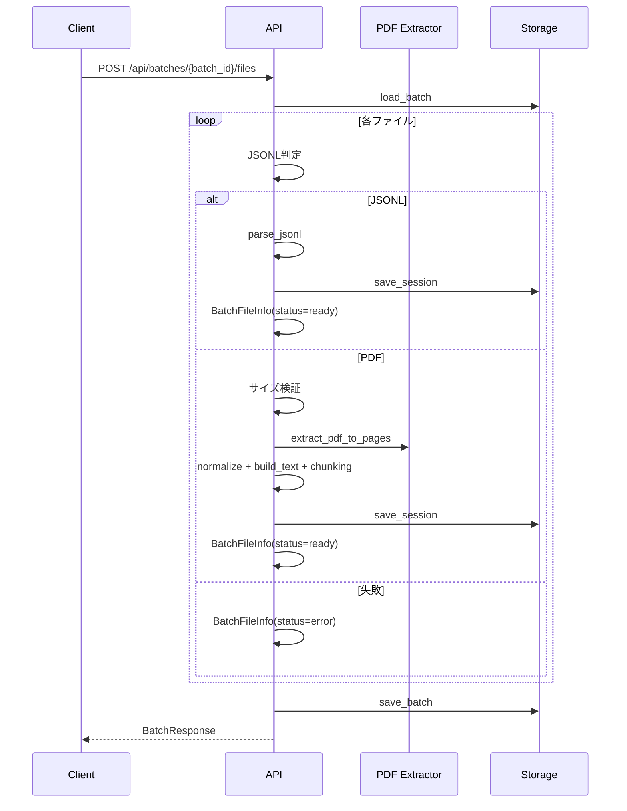
```mermaid
sequenceDiagram
  participant Client
  participant API
  participant PDF as PDF Extractor
  participant Storage
  Client->>API: POST /api/batches/{batch_id}/files
  API->>Storage: load_batch
  loop 各ファイル
    API->>API: JSONL判定
    alt JSONL
      API->>API: parse_jsonl
      API->>Storage: save_session
      API->>API: BatchFileInfo(status=ready)
    else PDF
      API->>API: サイズ検証
      API->>PDF: extract_pdf_to_pages
      API->>API: normalize + build_text + chunking
      API->>Storage: save_session
      API->>API: BatchFileInfo(status=ready)
    else 失敗
      API->>API: BatchFileInfo(status=error)
    end
  end
  API->>Storage: save_batch
  API-->>Client: BatchResponse
```

### 7.15 バッチ commit
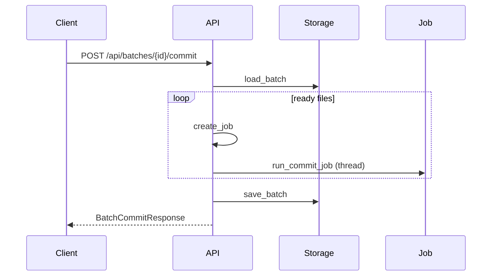
```mermaid
sequenceDiagram
  participant Client
  participant API
  participant Storage
  participant Job
  Client->>API: POST /api/batches/{id}/commit
  API->>Storage: load_batch
  loop ready files
    API->>API: create_job
    API->>Job: run_commit_job (thread)
  end
  API->>Storage: save_batch
  API-->>Client: BatchCommitResponse
```

### 7.16 バッチファイルステータス更新
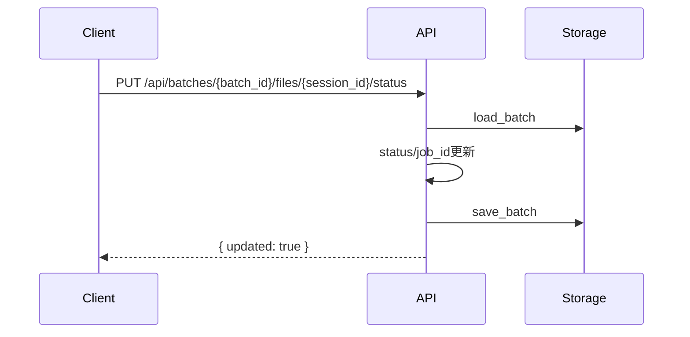
```mermaid
sequenceDiagram
  participant Client
  participant API
  participant Storage
  Client->>API: PUT /api/batches/{batch_id}/files/{session_id}/status
  API->>Storage: load_batch
  API->>API: status/job_id更新
  API->>Storage: save_batch
  API-->>Client: { updated: true }
```

### 7.17 ジョブステータス取得
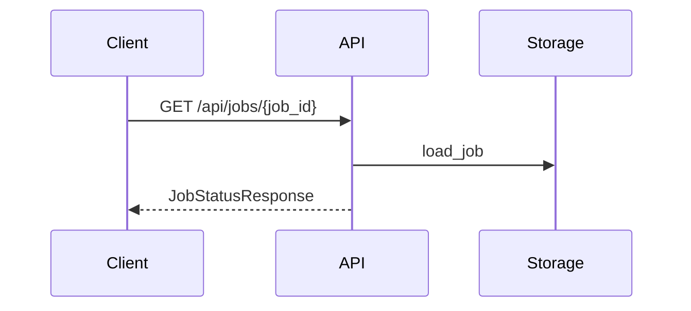
```mermaid
sequenceDiagram
  participant Client
  participant API
  participant Storage
  Client->>API: GET /api/jobs/{job_id}
  API->>Storage: load_job
  API-->>Client: JobStatusResponse
```

### 7.18 検索
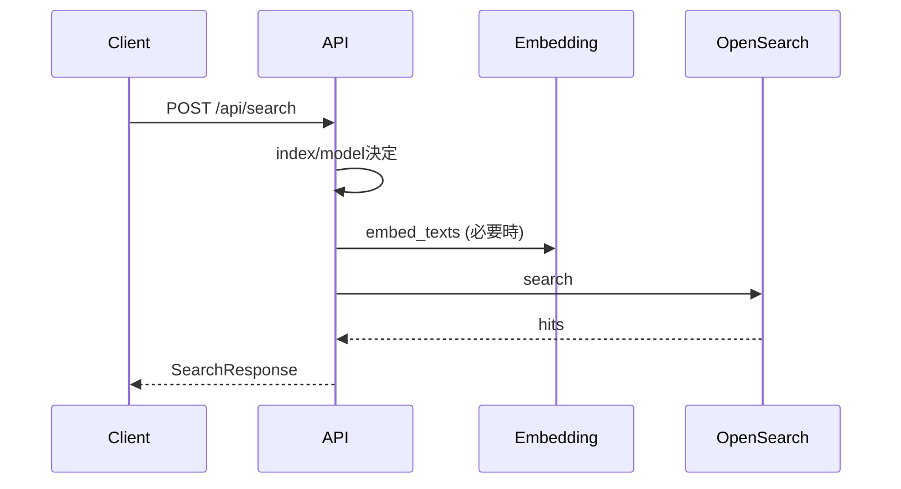
```mermaid
sequenceDiagram
  participant Client
  participant API
  participant Emb as Embedding
  participant OS as OpenSearch
  Client->>API: POST /api/search
  API->>API: index/model決定
  API->>Emb: embed_texts (必要時)
  API->>OS: search
  OS-->>API: hits
  API-->>Client: SearchResponse
```

### 7.19 Embedding モデル一覧・次元取得
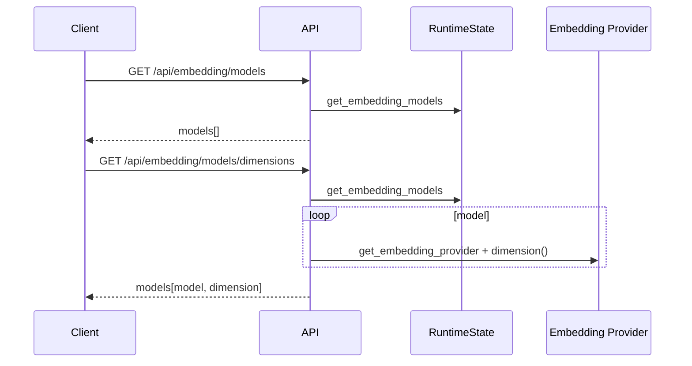
```mermaid
sequenceDiagram
  participant Client
  participant API
  participant Runtime as RuntimeState
  participant Emb as Embedding Provider
  Client->>API: GET /api/embedding/models
  API->>Runtime: get_embedding_models
  API-->>Client: models[]
  Client->>API: GET /api/embedding/models/dimensions
  API->>Runtime: get_embedding_models
  loop model
    API->>Emb: get_embedding_provider + dimension()
  end
  API-->>Client: models[model, dimension]
```

### 7.20 Indices 一覧・詳細・削除
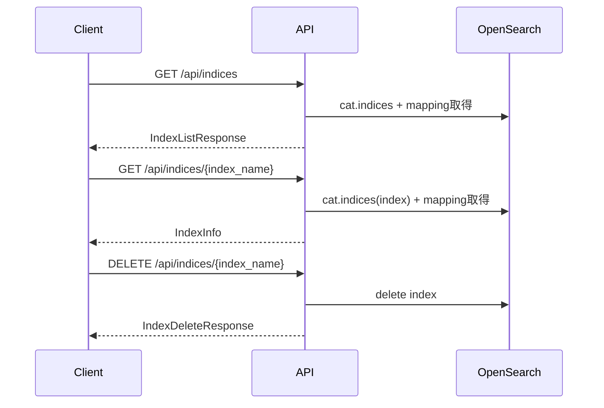
```mermaid
sequenceDiagram
  participant Client
  participant API
  participant OS as OpenSearch
  Client->>API: GET /api/indices
  API->>OS: cat.indices + mapping取得
  API-->>Client: IndexListResponse
  Client->>API: GET /api/indices/{index_name}
  API->>OS: cat.indices(index) + mapping取得
  API-->>Client: IndexInfo
  Client->>API: DELETE /api/indices/{index_name}
  API->>OS: delete index
  API-->>Client: IndexDeleteResponse
```

### 7.21 Health / Root
```mermaid
sequenceDiagram
  participant Client
  participant API
  Client->>API: GET /healthz
  API-->>Client: HealthResponse
  Client->>API: GET /
  API-->>Client: API info
```

### 7.22 起動時初期化
```mermaid
sequenceDiagram
  participant App
  participant Storage
  participant OpenAI as OpenAI API
  App->>App: 起動イベント
  alt CHUNKSMITH_CLEAR_STORAGE_ON_STARTUP=true
    App->>Storage: purge_storage
  end
  App->>OpenAI: /v1/models
  App->>OpenAI: embeddings.create (モデル検証)
  App->>App: embeddingモデル登録
```

---

## 8. チャンク生成仕様
### 8.1 split_mode
| mode | 概要 | 分割基準 |
|---|---|---|
| `chars` | 固定長分割 | 文字数ベース |
| `paragraph` | 段落優先 | `\n\n` → `\n` 境界にスナップ |
| `heading` | 見出し優先 | 見出し正規表現 + 段落境界 |

### 8.2 オーバーラップ
- `overlap` 文字分だけ次チャンク開始位置を戻す。
- 境界スナップにより実際の開始位置は前後する。

### 8.3 チャンク ID / ハッシュ
- チャンク ID: `P{page_no:03d}-C{index:03d}`
- ページハッシュ: `doc_id:page:{page_no}:{page_text}` の SHA256
- チャンクハッシュ: `doc_id:chunk:{chunk_id}:{chunk_text}` の SHA256

### 8.4 警告
- チャンク本文が短い場合 `CHUNK_TOO_SHORT` を付与。

---

## 9. OpenSearch 連携仕様
### 9.1 インデックス名
- `OPENSEARCH_BASE_INDEX` + `__` + `sanitize(model)`  
  例: `chunksmith-chunks__text_embedding_3_large`

### 9.2 Mapping 主要項目
- `vector`: `knn_vector`（dimension 必須）
- `text`: `text` フィールド（BM25 対応）
- `metadata`, `chunk_strategy`, `embedding`: `object`
- kNN 設定: `hnsw`, `cosinesimil`, `nmslib`

### 9.3 commit 動作
- Embedding 生成 → bulk index の二段階
- 進捗は 0.0〜0.5（embedding）/ 0.5〜1.0（bulk）
- `_id` にチャンクハッシュを使用（冪等性）

### 9.4 dimension 整合性
- `index_name` 指定時、既存 index の dimension と不一致なら `OPENSEARCH_DIMENSION_MISMATCH`

---

## 10. Embedding 連携仕様
### 10.1 モデル検出
- `/v1/models` から取得したモデル名に `embedding` を含むものを候補化。
- 候補ごとに `embeddings.create` を実行し、成功したモデルのみ登録。

### 10.2 Provider
- LangChain OpenAIEmbeddings を使用。
- `dimension()` は初回 embedding で確定しキャッシュ。

---

## 11. JSONL 取り込み仕様
### 11.1 フォーマット
- 1 行 1 JSON object
- 必須: `text`
- 任意: `doc_id`, `chunk_id`, `metadata`

### 11.2 検証
- UTF-8 でない場合はエラー
- 空行は無視
- `text` が空の場合は警告としてスキップ

### 11.3 取り込み方式
- `doc_id` ごとに 1 ページとして集約
- ページ間/チャンク間は `\n\n---\n\n` で区切る
- chunk metadata の `custom` に JSONL の `metadata` を格納

---

## 12. エラーコードと HTTP ステータス
| code | 概要 | HTTP |
|---|---|---|
| `PDF_TOO_LARGE` | サイズ超過 | 413 |
| `PDF_EXTRACT_FAILED` | PDF 抽出失敗 | 422 |
| `PAGE_MARKER_INVALID` | ページマーカー不正 | 422 |
| `VERSION_CONFLICT` | 楽観ロック不一致 | 409 |
| `OPENSEARCH_DIMENSION_MISMATCH` | 次元不一致 | 400 |
| `EMBEDDING_FAILED` | embedding 失敗 | 500 |
| `OPENSEARCH_ERROR` | OpenSearch 失敗 | 500 |
| `JOB_NOT_FOUND` | ジョブ未検出 | 404 |
| `SESSION_NOT_FOUND` | セッション未検出 | 404 |
| `CHUNK_NOT_FOUND` | チャンク未検出 | 404 |
| `BATCH_NOT_FOUND` | バッチ未検出 | 404 |
| `INDEX_NOT_FOUND` | インデックス未検出 | 404 |
| `VALIDATION_ERROR` | バリデーション想定 | 400 |

---

## 13. 設定・環境変数
- `CHUNKSMITH_ENV`
- `CHUNKSMITH_STORAGE_DIR`
- `CHUNKSMITH_CLEAR_STORAGE_ON_STARTUP`
- `CHUNKSMITH_MAX_PDF_MB`
- `CHUNKSMITH_CORS_ORIGINS`
- `PDF_EXTRACTOR`
- `PDF_EXTRACTOR_VERSION`
- `OPENAI_API_KEY`
- `OPENAI_BASE_URL`
- `OPENSEARCH_HOST`
- `OPENSEARCH_BASE_INDEX`
- `OPENSEARCH_BULK_SIZE`
- `OPENSEARCH_VERIFY_SSL`
- `OPENSEARCH_USERNAME`
- `OPENSEARCH_PASSWORD`
- `DEFAULT_CHUNK_SIZE`
- `DEFAULT_OVERLAP`
- `DEFAULT_SPLIT_MODE`
- `DEFAULT_NORMALIZE`

---

## 14. 非機能要件・制約
- **サイズ制限**: PDF は `CHUNKSMITH_MAX_PDF_MB` を超えると拒否。
- **永続化**: JSON ファイルであり高負荷同時書き込みには非対応。
- **並列性**: commit はスレッド実行。ジョブ並列数制御は未実装。
- **検索一貫性**: bulk 時 `refresh=true` で即時検索可能。
- **冪等性**: `_id=chunk.hash` により再 commit で上書き。

---

## 15. 既知の制約・改善余地
- `POST /api/batches/{batch_id}/files` の PDF 追加は実装上未完（セッション作成・batch 追加が不足）。
- Embedding モデル一覧の取得に失敗すると起動が例外で停止（README 記載の `EMBEDDING_MODELS` フォールバックは未実装）。
- JSONL セッションはページマーカーを持たないため、`PUT /sessions/{id}/text` で更新するとページマーカー検証に失敗する可能性がある。
- `search_builders.build_knn_query` の `num_candidates` 引数は未使用。
- チャンクメタデータ更新は `updated_at` を更新しない（現状）。

